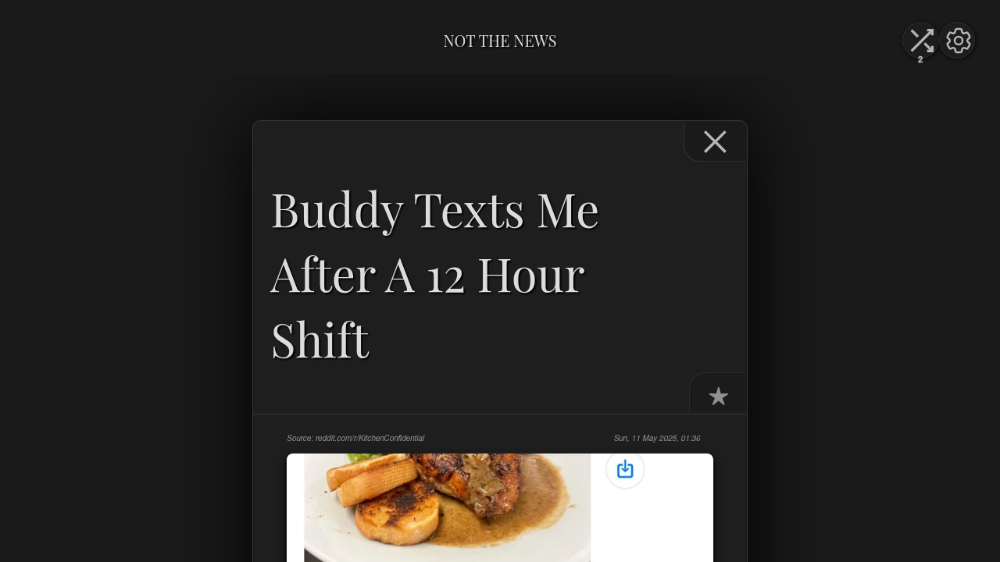

# Not The News



Not The News is a 'Deck-based RSS feed system' designed to prevent doom-scrolling and reclaim your time.

## The Premise

Stop wasting time on algorithms you can't control, video reels, and intrusive ads. Not The News is a minimal, focused RSS reader that scratches the itch for a personal, ad-free information stream.

### How it Works:
- **Focused Reading:** You only see 10 items at a time. To see more, you must consume the current deck.
- **Persistent State:** When you read and close an item, it's hidden forever (unless starred or viewed in 'Read' mode).
- **Limited Shuffles:** You get 2 shuffles per day to refresh your deck with new random content. Clearing your deck earns you a free shuffle!
- **Zero Friction:** No folders, no complex management. Just read and go.

## Modern Tech Stack

The project has been modernized to run entirely on serverless infrastructure for maximum performance and minimum maintenance:

- **Frontend:** Vite + Alpine.js (Hosted on **Cloudflare Pages**)
- **Backend:** Cloudflare Workers (RSS processing & API)
- **Database:** Firebase Firestore (Multi-user state persistence)
- **Auth:** Firebase Authentication (Google & Email/Password)
- **PWA:** Full offline support and "Install as App" capability.

## Features

- **Multi-User:** Secure accounts with private feed configurations.
- **Keyword Filtering:** Automatically filter out noise using a personalized blacklist.
- **Smart Deck Generation:** Algorithms prioritize fresh content while ensuring variety.
- **Offline First:** Read your synced content even without an internet connection.
- **Cross-Device Sync:** Seamlessly transition between desktop and mobile.
- **TTS Support:** Built-in "Read Out Loud" feature for hands-free consumption.
- **Theming:** 18+ beautiful themes including Nord, Dracula, and Catppuccin.

## Local Development (Containerless)

You no longer need Docker or root access to run Not The News locally.

### 1. Prerequisites
- [Node.js 20+](https://nodejs.org/)
- [Firebase Account](https://firebase.google.com/) (Free tier)
- [Cloudflare Wrangler](https://developers.cloudflare.com/workers/wrangler/install-cli/) (`npm install -g wrangler`)

### 2. Setup
1. Clone the repo:
   ```bash
   git clone https://github.com/tim-projects/not-the-news.git
   cd not-the-news
   ```
2. Install dependencies:
   ```bash
   npm install
   cd worker && npm install && cd ..
   ```
3. Configure Environment:
   - Create `.env.development` in the root with your Firebase credentials.
   - Create `worker/.dev.vars` with your backend secrets (Wrangler will use this for local dev).

### 3. Run
Start both the frontend and backend with a single command:
```bash
./run-local.sh
```
- **Frontend:** `http://localhost:5173`
- **Backend:** `http://localhost:8787`

*Note: This script uses `systemd --user` to manage processes. Use `systemctl --user stop ntn-frontend ntn-backend` to shut down.*

## Deployment

### Frontend (Cloudflare Pages)
1. Connect your GitHub repo to Cloudflare Pages.
2. Build command: `npm run build`
3. Output directory: `www`
4. Add your `VITE_FIREBASE_*` variables to the project settings.

### Backend (Cloudflare Workers)
1. Navigate to the `worker/` directory.
2. Deploy using Wrangler:
   ```bash
   npx wrangler deploy
   ```
3. Set your production secrets in the Cloudflare Dashboard (or via `wrangler secret put`).

## Backup & Restore

Backup is now a core feature of the application UI. You can export your entire configuration (feeds, history, themes) as a JSON file directly from the **ADVANCED SETTINGS** menu. This file can be restored to any account, providing a simple way to migrate or safeguard your data.